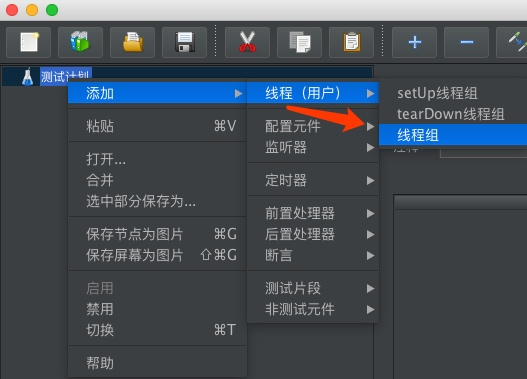
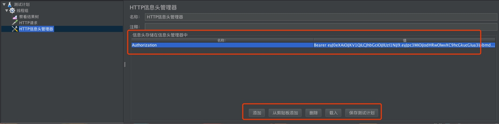
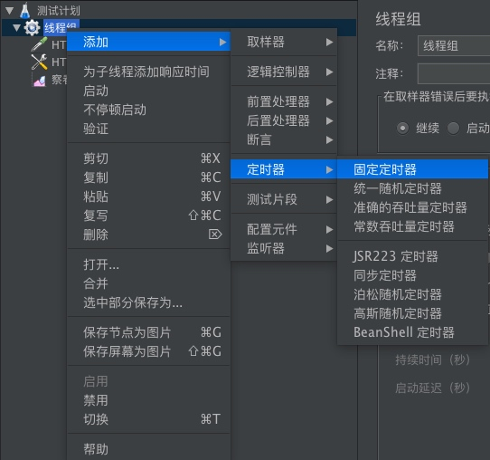
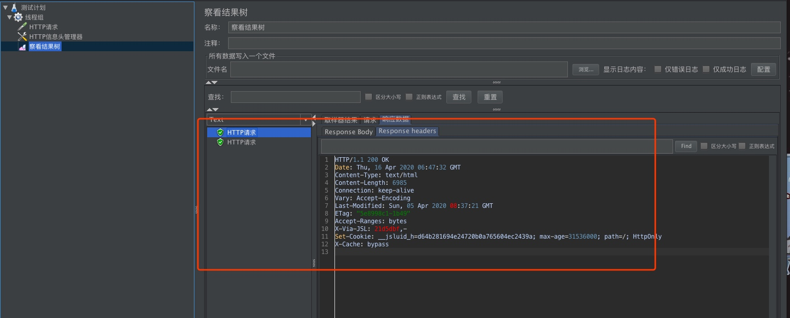

# JMeter使用
```
Author:si1ent
Date:4/16
```
## 描述
Apache JMeter是Apache组织开发的基于Java的压力测试工具。用于对软件做压力测试，它最初被设计用于Web应用测试但后来扩展到其他测试领域。 它可以用于测试静态和动态资源例如静态文件、Java 小服务程序、CGI 脚本、Java 对象、数据库， FTP 服务器， 等等。JMeter 可以用于对服务器、网络或对象模拟巨大的负载，来在不同压力类别下测试它们的强度和分析整体性能。另外，JMeter能够对应用程序做功能/回归测试，通过创建带有断言的脚本来验证你的程序返回了你期望的结果。为了最大限度的灵活性，JMeter允许使用正则表达式创建断言。 Apache jmeter 可以用于对静态的和动态的资源（文件，Servlet，Perl脚本，java 对象，数据库和查询，FTP服务器等等）的性能进行测试。它可以用于对服务器，网络 或对象模拟繁重的负载来测试它们的强度或分析不同压力类型下的整体性能。你可以使用它做性能的图形分析或在大并发负载测试你的服务器/脚本/对象。
## 原理
### 1、体系结构
JMeter结构图如下：  
  
这是一个三维空间，三位坐标轴分别是X、Y、Z  
**X轴**：描述的是不同组件，这些组件是独立的个体，我们依靠这些组件完成性能测试中负载的模拟；其中包含的组件分别是：  
**X1采集器/取样器(Sampler)**：采集器用来向服务器发送HTTP请求，并接受服务器的响应数据，JMeter的采集器有很多原件（采集器称为组件，其中的具体一种采集器如HTTP采样器称为元件），基本涵盖了常见的协议，如FTP、HTTP、JAVA、JMS、LDAP、MAIL、MongoDB、SMTP、SOAP、TCP、JUnit等    
  
**X1断言(Assertions)**：断言用来验证结果是否正确，即判断请求是否成功、返回数据是否符合要求等，通过预设的结果和实际返回的结果进行比较，匹配到就说明断言成功，JMeter的断言组件也有多种元件，如响应断言、XML断言、BeanShell断言。  
  
**X1监听器（Listener）**：监听器用来收集测试结果，监听器有两个任务，即添加结果监听和展示结果，监听器组件也有很多种元件。  
```
采集器+断言+监听器：组合一起就可以完成一次请求、验证结果、记录结果工作。
如下图所示：
```
  

**X2前置处理器（Pre Processors）**：前置处理器用来完成请求发送前的的一些环境或者参数的标准工作，比如操作数据库需要建立一个数据库连接。  
  

**X2配置原件（Config Element）**：配置原件用来采集器提供预备数据（比如请求头的一些数据：Cookie、Token等），比如做参数化，生成动态数据，或从文件中读取测试数据等。  
  

**X2后置处理器（Post Processor）**：后置处理器用来处理服务器响应中的数据，比如获取登录后的session_id，后置处理器一般放在采集器之后。   
```
前置处理器+配置元件+后置处理器：都是给采集器提供数据锁支持的，而采集器关注的是业务逻辑。
```

**X3控制器（Logic Controller）**：控制器用来控制采样器的执行逻辑，如执行顺序、执行次数等；各种控制器组合在一起，也能完成各种奇葩需求。  
  

**X4定时器（Timer）**：定时器用来完成集合的功能，比如为了足够真实地模拟用户负载，会需要模拟这些请求同一个时刻发送，定时器也有多种元件   
  

**X5线程组（Threads）**：线程组用来模拟大量用户负载的情况，可以设置运行的线程组（一个线程一个用户）、运行时长、定时运行等。  
  

**Y纬度**实际是性能测试进行了一个划分，Y1是负责模拟用户请求的部分，Y2负责验证结果正确的部分，因为这两部分同时需要线程组，所有事相交的。  

**Z纬度**只有一个监听器（Listenter），监听器用来负责结果收集，监听器不仅可以放在线程组之内，也可以放在线程组之外，所以监听器与它们是相交的。  

### 2、JMeter运行原理
JMeter是以线程的方式运行的，通过线程组来驱动多线程运行测试脚本，对被测服务器发送负载，每一个负载机上都可以运行多个线程组。  
JMeter的场景运行，基于操作方式，可以分为两种：  
* GUI：图形用户界面运行模式，可视化、更加直观，方便实时查看运行状态，如测试结果、运行线程数等。  
* 非GUI：命令行模式，对负载机的资源消耗更小，    
   

基于运行结构，也可以分为两种：  
本地化运行或称单机运行、远程运行，不论是GUI模式还是非GUI模式，都支持本地化运行与远程运行。  
* 本地运行：只运行一台JMeter机器，所有的请求从一台机器发出。  
* 远程运行：一台JMeter控制机（Master）控制远程多台机器来产生负载。  
* 负载机：向待测服务器发起负载请求的机器，与其他支持远程运行的测试工具一样，负载机受控制管理时，首先启动一个客户端Agent程序，控制机才可以接管负载机。  
* 控制机：控制机也是一台负载机，只不过是多台负载机中被选中作为管理机的那台机器，所以控制机也可以参与脚本的运行，同时担负着管理和指挥远程的负载机运行的任务，并且收集远程的负载机测试结果。  

远程运行的逻辑：  
* 远程机首先启动Agent程序(运行jmeter-server.bat)
* 控制机连接上负载机（修改配置文件，会自动探测并链接）
* 控制机发送指令（脚本及启动命令）启动线程（参数化文件或依赖包需要手工拷贝到远程负载机上）
* 负载机运行脚本，回传状态（包括测试结果）
* 控制机收集结果并回显。

### 3、JMeter测试计划要素   
JMeter中一个脚本，就是一个测试计划，也是一个管理单元；JMeter的请求模拟、并发数（即设置的线程数、一个线程数代表一个虚拟用户）的设置都在脚本文件中一起设置。  
* 要素一：脚本中的测试计划只能有一个
* 要素二：测试计划中至少要有一个线程组
* 要素三：至少要一个采集器
* 要素四：至少要有一个监听器，至于JMeter中的其他元件，都是为这些要素服务的。

### 4、JMeter工作目录
JMeter的工作目录下主要有以下的文件夹/文件：
* bin：放置各项配置文件（如日志设置、JVM设置）、启动文件、启动JAR文件、实例脚本等。
* docs：放置JMeter API的离线帮助文档。
* extras：JMeter辅助功能，提供与Ant、Jenkins提成的可能性，用来构建性能测试自动化框架
* lib：JMeter组件以Jar包的形式放置在lib/ext目录下，如果要扩展JMeter组件，Jar包就放在此目录下，Jmeter启动是会加载此目录下的Jar包。
* printable_docs:放置Jmeter的离线帮助文件，可用来学习JMeter。

### 5、小结
JMeter运行逻辑：
* 采集器模拟用户请求：可使用前置管理器做环境及数据的准备，用后置处理器做响应数据的处理。
* 控制运行：使用线程组来设置运行场景，利用逻辑控制器来控制业务（控制取样器）
* 收集结果：利用断言来验证测试结果，利用监听器来收集显示测试结果。

## 下载地址  
[JMeter下载地址](http://jmeter.apache.org/download_jmeter.cgi)  

## JMeter运行
进入JMeter主目录的bin子目录下 点击jmeter.bat或jmeter.sh文件即可运行（启动有点慢哦，耐心等待）  
  

## 模拟高并发
### 程序运行

bash jmeter.sh  
  

### 新建线程组
启动后，如进行高并发测试，需先新建“线程组”  
  
  

### 建立一个循环控制器  
主要是让每一个线程一直循环执行下去，这款可以手动停止。其实在新建线程组属性处可以看到循环次数有点击“永远”或者自动设置一个数字指定循环次数。  
  

### 配置HTTP信息  
如果涉及post请求、用户Cookie认证时需要配置HTTP请求头部信息，这里模拟用户JWT认证配置Token  
  

### 设置固定定时器
让线程组经过多少时间进行下一次操作，  
  
时间默认即可，也可以自己设定  
  

### 设置HTTP请求
主要设置待测服务器地址及URI、端口号等信息  
  

### 配置函数并随机请求目录或文件
类似目录、文件枚举工具一样，进行枚举请求。  
  
选择一个功能
  
配置文件路径（绝对路径），配置好后，点击生成；将生成的url复制到我们开始填写路径的地方就可以了，这时线程会随机对文件中的路径进行访问  
  
  

  

### 新建监视器
主要查看请求结果是否正确，方便配置参数，这里建议开始设置一个线程，调试成功后再调整线程。  
  

### 点击运行后的弹窗设置  
新建的线程组，执行前会提醒我们是否进行保存配置，这样后面重新高并发无须配置导入即可。选择你需要保存的目录即可。  
  
### 执行结果查看  
  

### 窗口栏介绍  
  
其他自行点击查看  
## 参考
[JMeter简单实践](https://juejin.im/entry/57bd8c002e958a00694eb780)  
[JMeter原理概述](https://juejin.im/post/5d5112a9e51d4561cc25f010)  
[JMeter非GUI使用](https://www.cnblogs.com/fengpingfan/p/5586711.html)  


